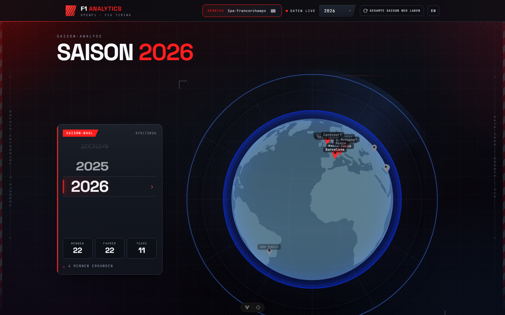
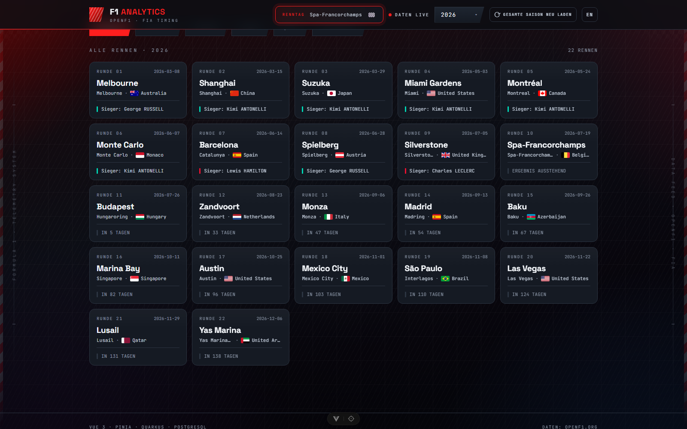
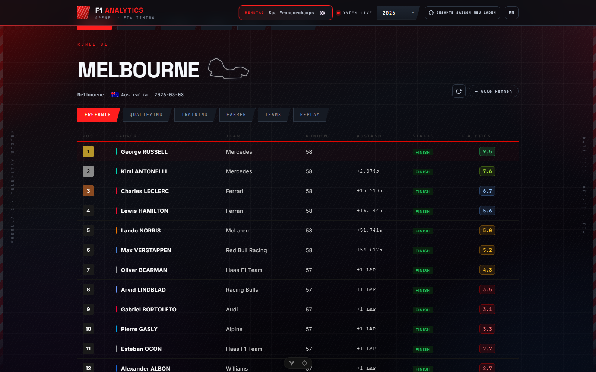
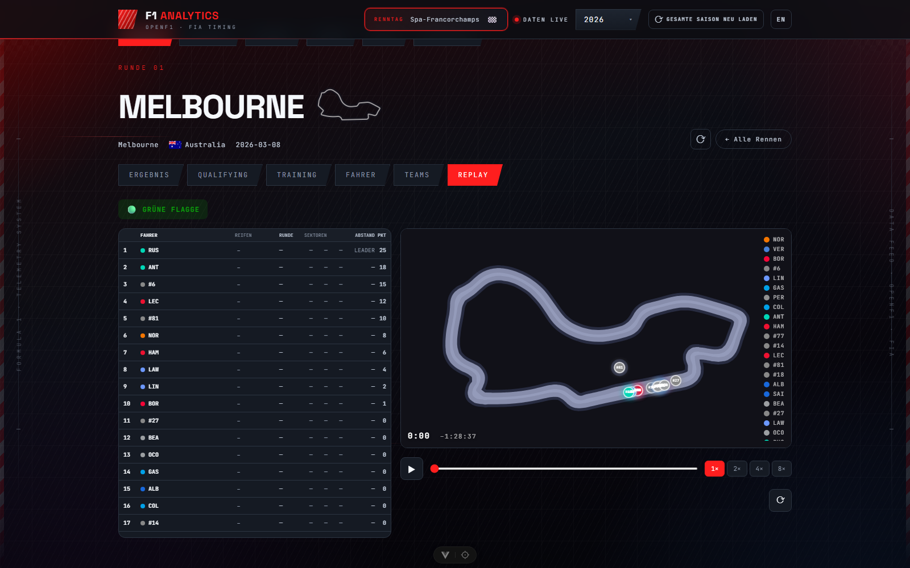
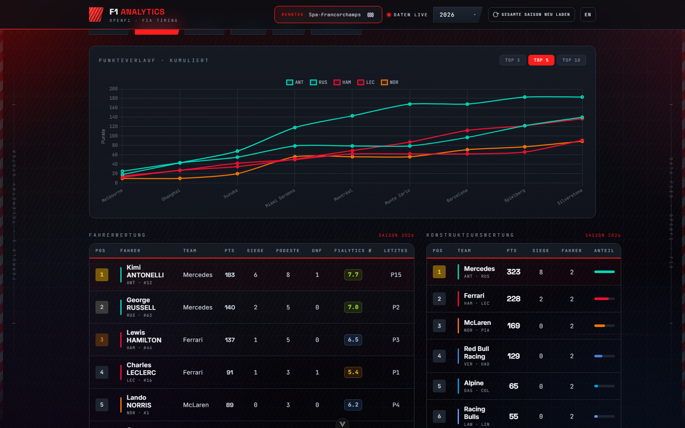
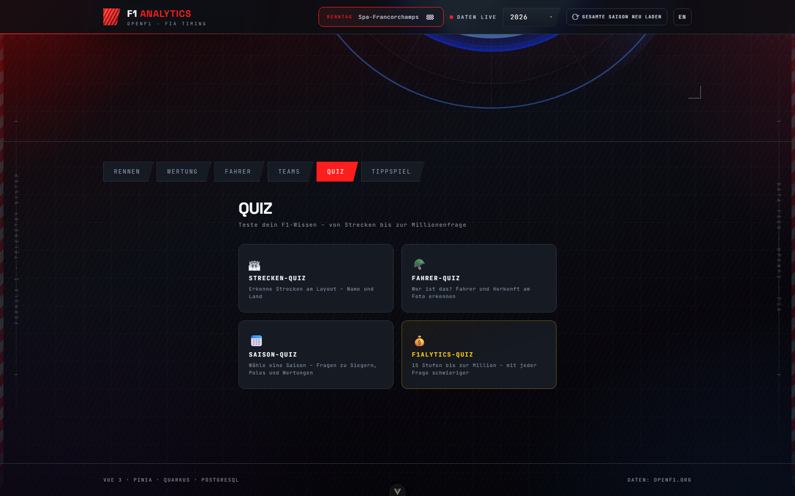
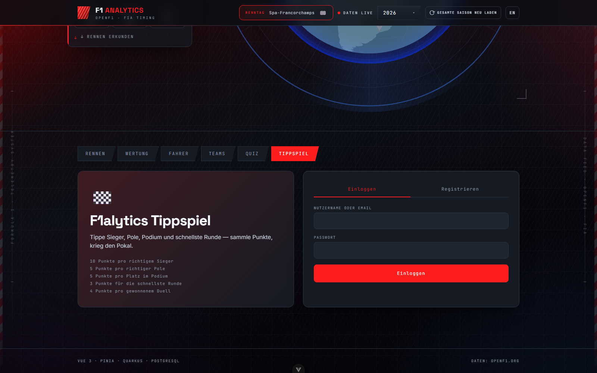

# F1 Analytics

Eine webbasierte Analyse-Plattform für Formel-1-Daten auf Basis der öffentlichen [OpenF1-API](https://openf1.org). Die Anwendung visualisiert Saison-Ergebnisse, Fahrer- und Konstrukteurswertungen, bietet einen GPS-basierten Renn-Replay sowie interaktive Quiz-Modi und ein Tippspiel.

---

## Screenshots

<table>
<tr>
<td width="50%">

**Startseite mit interaktivem 3D-Globus**
Saison-Auswahl per Drehrad und eine rotierende Weltkarte, die alle Rennstrecken der Saison markiert.



</td>
<td width="50%">

**Renn-Übersicht**
Alle Rennen der Saison als Karten-Raster mit Sieger, Termin und Status.



</td>
</tr>
<tr>
<td width="50%">

**Rennergebnis mit F1alytics Score**
Finale Platzierungen inkl. Abstand, Status und dem proprietären F1alytics-Score (1–10) je Fahrer.



</td>
<td width="50%">

**GPS-Renn-Replay**
Animierte Fahrzeugpositionen auf der Streckenkarte mit Live-Timing-Panel (Runde, Reifen, Abstand, Flaggen).



</td>
</tr>
<tr>
<td width="50%">

**Fahrer- & Konstrukteurswertung**
Kumulierter Punkteverlauf als Liniendiagramm sowie sortierte Fahrer- und Team-Tabellen.



</td>
<td width="50%">

**Quiz**
Vier Modi – Strecken-, Fahrer-, Saison- und Millionär-Quiz mit Gewinn-Leiter.



</td>
</tr>
<tr>
<td width="50%">

**Tippspiel**
Platzierungs-Tipps für bevorstehende Rennen mit Punktesystem, Gruppen und Login.



</td>
<td width="50%"></td>
</tr>
</table>

---

## Inhaltsverzeichnis

1. [Einführung](#1-einführung)
2. [Zielsetzung und Problemstellung](#2-zielsetzung-und-problemstellung)
3. [Komponentenarchitektur](#3-komponentenarchitektur)
4. [Beschreibung der wichtigsten Komponenten](#4-beschreibung-der-wichtigsten-komponenten)
5. [Technologiestack](#5-technologiestack)
6. [Setup- und Installationsanleitung](#6-setup--und-installationsanleitung)
7. [Wichtigste Funktionalitäten](#7-wichtigste-funktionalitäten)
8. [Projektstruktur](#8-projektstruktur)
9. [Bekannte Einschränkungen](#9-bekannte-einschränkungen)

---

## 1. Einführung

F1 Analytics ist eine lokale Single-Page-Application (SPA), die Formel-1-Daten aus der OpenF1-API bezieht, im eigenen PostgreSQL-Datenbankserver zwischenspeichert und über ein Vue-3-Frontend aufbereitet darstellt.

Die Plattform richtet sich an F1-Fans, die tiefer in Saison-Statistiken eintauchen möchten, als es offizielle Angebote erlauben. Sie kombiniert Datenvisualisierung (Wertungen, Charts, Strecken-Globus), telemetrischen Renn-Replay auf Basis von GPS-Positionsdaten, ein proprietäres Bewertungssystem (F1alytics Score), Quiz-Spiele sowie ein Tippspiel mit Gruppenunterstützung.

---

## 2. Zielsetzung und Problemstellung

### Problemstellung

Öffentlich zugängliche F1-Daten sind über mehrere APIs und Drittanbieter verteilt. Eine einheitliche Plattform, die Saison-Statistiken, historische Renndaten, GPS-Telemetrie und interaktive Funktionen (Quiz, Tippspiel) zusammenführt, fehlte bisher für den privaten/akademischen Bereich.

Zusätzlich stellt die OpenF1-API keine Caching-Schicht bereit — bei wiederholten Anfragen (z. B. beim Seitenaufruf) würden dieselben Daten erneut geladen, was zu langen Wartezeiten und unnötiger API-Belastung führt.

### Zielsetzung

- **Datenaggregation**: Alle relevanten F1-Daten einer Saison aus der OpenF1-API laden, lokal in PostgreSQL persistieren und performant abrufbar machen.
- **Visualisierung**: Wertungen, Rundenzeiten, Sektordaten und Ergebnisse übersichtlich darstellen.
- **Renn-Replay**: GPS-Positionsdaten aller Fahrer eines Rennens in Echtzeit-Simulation wiedergeben.
- **Gamification**: Quiz-Modi und ein Tippspiel mit Rangliste und Gruppen, um das Engagement zu steigern.
- **Scoring**: Einen eigenen F1alytics-Score berechnen, der Qualifying-Leistung, Rennergebnis und Positionsveränderungen gewichtet zusammenfasst.

---

## 3. Komponentenarchitektur

```
┌─────────────────────────────────────────────────────┐
│                    Browser (SPA)                     │
│             Vue 3 · Pinia · vue-i18n                │
│         http://localhost:5173                        │
└──────────────────────┬──────────────────────────────┘
                       │ HTTP / REST (JSON)
                       │ /api/*  (Vite-Proxy → :8081)
┌──────────────────────▼──────────────────────────────┐
│              Quarkus REST-API (Java 25)              │
│         http://localhost:8081                        │
│                                                      │
│  REST Resources  →  Services  →  F1DataStore        │
│                        │                            │
│              ┌─────────┴──────────┐                │
│              ▼                    ▼                 │
│       PostgreSQL DB         OpenF1 REST-Client      │
│       (f1analytics)         https://api.openf1.org  │
└─────────────────────────────────────────────────────┘
```

### Datenpfad

1. **Erster Aufruf**: Frontend fragt Backend an → Backend prüft DB → nicht vorhanden → Backend ruft OpenF1-API ab → speichert in DB → liefert Antwort.
2. **Folgeaufrufe**: Backend findet Daten in DB (oder RAM-Cache) → sofortige Antwort ohne API-Call.
3. **Cache-Invalidierung**: Über Frontend-Schaltflächen oder REST-DELETE-Endpunkte kann der Cache für einzelne Rennen oder ganze Saisons geleert werden.

---

## 4. Beschreibung der wichtigsten Komponenten

### Backend

| Klasse | Aufgabe |
|---|---|
| `SeasonService` | Aggregiert Saison-Daten (Rennen, Fahrer, Teams) aus OpenF1 und berechnet den F1alytics-Score. Verwaltet einen zweigliedrigen Cache (RAM + DB). |
| `ReplayService` | Lädt GPS-Positionsdaten pro Fahrer von OpenF1, filtert auf das Renn-Zeitfenster, speichert in DB und baut animierbare Frame-Sequenzen. Enthält Throttling (2,5 s/Anfrage) und Per-Session-Locking. |
| `ReplayTimingService` | Ergänzt den Replay um Live-Timing-Daten: Rundenzeiten, Reifen, Sektor-Splits, Safety-Car-Phasen. |
| `F1alyticsScore` | Proprietärer Scoring-Algorithmus (1–10): gewichtet Qualifying (Q), Rennergebnis (R), Positionsveränderung (Δ) und Bonus-Modifier. |
| `QuizService` | Stellt Streckendaten (Foto + Land) und Fahrerdaten (Foto, Herkunft, Geburtsjahr) für Quiz-Modi bereit. |
| `QuizGameService` | Implementiert das Millionär-Quiz (15 Fragen, Gewinn-Leiter 100 – 1.000.000 Pkt) und den Saison-Quiz-Modus. |
| `ForecastService` | Berechnet Gewinn-/Podiumswahrscheinlichkeiten je Fahrer mittels Softmax über gewichtete Scores (Punkte 35 %, Form 30 %, Siege 20 %, Strecke 15 %). |
| `BettingService` | Tippspiel-Logik: Punkte für korrekte Platzierungen, Auswertung nach Rennende, Rangliste. |
| `GroupService` | Erstellt und verwaltet Tipp-Gruppen; Einladung via 6-stelligem alphanumerischen Code. |
| `AuthService` | PBKDF2-Passwort-Hashing (100 000 Iterationen), 30-Tage-Session-Tokens, individuelle Fahrer-Farbpalette je Nutzer. |
| `F1DataStore` | Zentrale Datenbankzugriffs-Schicht; kapselt alle JPA-Operationen (CRUD) für alle Entitäten. |
| `CacheWarmer` | Heizt beim Serverstart die RAM-Caches aller gespeicherten Saisons vor, um den ersten Seitenaufruf zu beschleunigen. |

### Frontend

| Komponente | Aufgabe |
|---|---|
| `HomeView.vue` | Haupt-Ansicht: Saison-Auswahl, Tab-Navigation, Live-Lade-Fortschritt. |
| `RaceGrid.vue` | Rennübersicht als Karten-Raster; zeigt Sieger, Runde, Status (abgeschlossen / bevorstehend). |
| `RaceDetail.vue` | Detail-Ansicht eines Rennens mit Tabs: Ergebnis, Qualifying, Training, Fahrer, Teams, Replay. |
| `ReplayTab.vue` | GPS-Replay-Visualisierung: animiert Fahrzeugpositionen auf der Streckenkarte, daneben Live-Timing-Panel mit Runden, Reifen, Sektoren. |
| `SeasonStandings.vue` | Fahrer- und Konstrukteurswertung als sortierte Tabelle mit F1alytics-Score-Spalte. |
| `GlobeView.vue` | Interaktiver 3D-Globus (Three.js), der alle Rennstrecken der Saison markiert. |
| `PointsChart.vue` | Kumulierter Punkteverlauf aller Fahrer als Chart.js-Liniendiagramm. |
| `QuizTab.vue` | Vier Quiz-Modi: Strecken-Quiz, Fahrer-Quiz, Saison-Quiz, Millionär-Quiz (mit Jokern). |
| `TippspielTab.vue` | Tippspiel: Platzierungs-Tipps für bevorstehende Rennen, Prognose-Panel, Gruppen-Rangliste. |
| `TheHeader.vue` | Globale Navigation mit Sprachschalter (DE/EN), Countdown bis zum nächsten Rennen, Live-Indikator. |
| `seasonStore.ts` | Pinia-Store: zentraler Zustand für Saison-Daten, Race-Selection, Lade-State, Polling bei Live-Sessions. |
| `authStore.ts` | Pinia-Store: Session-Token, Nutzer-Info, Gruppen-Zugehörigkeit. |

---

## 5. Technologiestack

### Backend

| Kategorie | Technologie | Version |
|---|---|---|
| Laufzeit | Java | 25 |
| Framework | Quarkus | 3.36.1 |
| ORM | Hibernate ORM + Panache | (Quarkus BOM) |
| REST | Quarkus REST (RESTEasy Reactive) | (Quarkus BOM) |
| REST-Client | Quarkus REST Client Jackson | (Quarkus BOM) |
| Datenbank-Treiber | Quarkus JDBC PostgreSQL | (Quarkus BOM) |
| DI | Quarkus Arc (CDI) | (Quarkus BOM) |
| Build | Apache Maven | 3.8+ |
| Test | JUnit 5 + REST Assured | (Quarkus BOM) |

### Frontend

| Kategorie | Technologie | Version |
|---|---|---|
| Framework | Vue 3 | ^3.5.32 |
| Sprache | TypeScript | ~6.0.0 |
| State Management | Pinia | ^3.0.4 |
| Routing | Vue Router | ^5.0.4 |
| Internationalisierung | vue-i18n | ^10.0.8 |
| Charts | Chart.js + vue-chartjs | ^4.5.1 / ^5.3.3 |
| 3D-Grafik | Three.js | ^0.184.0 |
| Build-Tool | Vite | ^8.0.8 |
| Linting | Oxlint + ESLint | ~1.60.0 / ^10.2.1 |
| Formatierung | Prettier | 3.8.3 |
| Tests | Vitest + @vue/test-utils | ^4.1.4 / ^2.4.6 |
| Node.js | — | ^20.19.0 oder ≥ 22.12.0 |

### Datenbank & externe Dienste

| Dienst | Beschreibung |
|---|---|
| PostgreSQL | Lokale Datenpersistenz (DB: `f1analytics`) |
| OpenF1 API | Kostenlose öffentliche F1-Datenschnittstelle (https://api.openf1.org) |

---

## 6. Setup- und Installationsanleitung

### Voraussetzungen

- **Java 25** (oder kompatible Version ≥ 17)
- **Apache Maven** 3.8+
- **Node.js** ^20.19.0 oder ≥ 22.12.0 (mit `npm`)
- **PostgreSQL** (lokal laufend)

### 1. Datenbank einrichten

```sql
-- In psql oder pgAdmin ausführen:
CREATE DATABASE f1analytics;
```

> Der Datenbank-User und das Passwort können in `backend/src/main/resources/application.properties` angepasst werden (Standardwerte: `postgres` / `Openf1`).

Die Tabellen werden beim ersten Backend-Start automatisch durch Hibernate angelegt (`schema-management.strategy=update`).

### 2. Backend starten

```bash
cd backend
./mvnw quarkus:dev        # Linux / macOS
.\mvnw.cmd quarkus:dev    # Windows (PowerShell)
```

Das Backend ist erreichbar unter: **http://localhost:8081**

Beim ersten Start lädt der `CacheWarmer` alle bereits in der Datenbank vorhandenen Saisons in den RAM-Cache vor.

### 3. Frontend starten

```bash
cd frontend
npm install       # einmalig beim ersten Start
npm run dev
```

Das Frontend ist erreichbar unter: **http://localhost:5173**

> Das Vite-Dev-Server-Proxy leitet alle Anfragen an `/api/*` automatisch an `http://localhost:8081` weiter — kein separates CORS-Setup für die Entwicklung nötig.

### 4. Daten laden

Beim ersten Öffnen des Frontends und Auswählen einer Saison fragt das Backend die OpenF1-API ab. Dieser Vorgang kann — je nach Datenmenge — **mehrere Minuten** dauern, da die API-Rate durch einen Throttle von 2,5 s pro Anfrage eingeschränkt wird.

Der Fortschritt wird im Frontend durch einen Ladebalken angezeigt.

### Produktions-Build

```bash
# Frontend
cd frontend && npm run build   # Erzeugt dist/

# Backend (JVM-Jar)
cd backend && ./mvnw package
java -jar target/quarkus-app/quarkus-run.jar

# Backend (Native)
cd backend && ./mvnw package -Dnative
./target/backend-runner
```

### Qualitätsprüfung (optional)

```bash
# Alle Checks (Lint, TypeCheck, Tests, Compile)
bash check.sh

# Nur Frontend
bash check.sh --frontend-only

# Nur Backend
bash check.sh --backend-only
```

---

## 7. Wichtigste Funktionalitäten

### Saison-Analyse

Über den **RENNEN**-Tab wird eine Übersicht aller Rennen der gewählten Saison angezeigt. Ein Klick auf ein Rennen öffnet die Detail-Ansicht mit:

- **Ergebnis-Tab**: Finale Rennplatzierungen mit Punkten, Abstand, DNF/DNS-Flags und F1alytics-Score.
- **Qualifying-Tab**: Qualifying-Ergebnisse mit Bestzeiten und Abständen.
- **Training-Tab**: Ergebnisse der freien Trainingseinheiten.
- **Fahrer- und Teams-Tab**: Detailauswertungen pro Fahrer bzw. Konstrukteur für dieses Rennen.

### Fahrer- und Konstrukteurswertung

Der **WERTUNG**-Tab zeigt kumulierte Fahrer- und Konstrukteurs-Punkte sowie den F1alytics-Durchschnittsscore. Ein Punkteverlauf-Diagramm stellt die Entwicklung über die Saison grafisch dar.

### Renn-Replay

Der **REPLAY**-Tab in der Renndetailansicht visualisiert die GPS-Positionsdaten aller Fahrer auf der Streckenkarte. Funktionen:

- Abspielen, Pausieren, Vor- und Zurückspulen per Zeitstrahl.
- Geschwindigkeitsregelung (0,5× bis 16×).
- Daneben: Live-Timing-Panel mit aktueller Runde, Reifentyp, Sektor-Zeiten und Abstand zum Führenden.
- Flaggen-Anzeige (Grün, Gelb, Rot, Ziel).

GPS-Daten werden beim ersten Aufruf von OpenF1 geladen (~20 Fahrer × 2,5 s Throttle ≈ 50 s Ladezeit) und danach lokal gecacht.

### F1alytics Score

Jeder Fahrer erhält pro Rennen einen Score von 1–10, der folgende Faktoren gewichtet:

| Faktor | Beschreibung |
|---|---|
| Qualifying (Q) | Startplatz relativ zum Feld |
| Rennergebnis (R) | Finale Position relativ zum Feld |
| Positionsveränderung (Δ) | Gewonnene/verlorene Plätze |
| Basis + Modifier | Pole-Position-, Sieger- und DNF-Bonus |

### Quiz

Der **QUIZ**-Tab bietet vier Modi:

| Modus | Beschreibung |
|---|---|
| **Strecken-Quiz** | Streckenfotos erkennen und benennen (inkl. Land) |
| **Fahrer-Quiz** | Fahrer am Foto erkennen (Herkunftsland oder Name) |
| **Saison-Quiz** | Saison-spezifische Fragen zu Siegen, Poles, Wertungen |
| **Millionär-Quiz** | 15 Fragen mit steigender Schwierigkeit, drei Joker (50:50, Publikum, Telefon-Joker), Gewinn-Leiter 100–1.000.000 Punkte |

### Tippspiel

Der **TIPPSPIEL**-Tab ermöglicht:

- **Tipps abgeben**: Platzierungsvorhersagen für bevorstehende Rennen.
- **Prognosen**: KI-basierte Gewinn-/Podiumswahrscheinlichkeiten pro Fahrer (Softmax-Modell).
- **Gruppen**: Gruppen erstellen oder per Einladungscode beitreten; gemeinsame Rangliste.
- **Rangliste**: Punkte für korrekte Tipps werden nach Rennende automatisch vergeben.

### Globus-Ansicht

Eine interaktive 3D-Weltkarte (Three.js) markiert alle Rennstrecken der ausgewählten Saison und dreht sich zu ausgewählten Rennen.

### Mehrsprachigkeit

Die App ist vollständig auf **Deutsch** und **Englisch** verfügbar; der Sprachschalter befindet sich im Header.

---

## 8. Projektstruktur

```
f1-analytics/
│
├── backend/                          Quarkus-Backend (Java)
│   ├── src/main/java/de/htw/f1analytics/
│   │   ├── api/                      REST-Ressourcen (7 Endpunkte)
│   │   │   ├── AuthResource.java     Registrierung, Login, Logout
│   │   │   ├── BettingResource.java  Tipp-Endpunkte
│   │   │   ├── ForecastResource.java Fahrer-Prognosen
│   │   │   ├── GroupResource.java    Gruppen-Verwaltung
│   │   │   ├── QuizResource.java     Quiz-Daten & Spiel-Session
│   │   │   ├── ReplayResource.java   GPS-Replay & Timing
│   │   │   └── SeasonResource.java   Saison, Rennen, Cache
│   │   ├── client/                   OpenF1-API-DTOs & Interface
│   │   ├── domain/                   JPA-Entitäten (11 Klassen)
│   │   └── service/                  Business-Logik (14 Services)
│   ├── src/main/resources/
│   │   └── application.properties    Konfiguration (DB, CORS, Ports)
│   ├── src/test/                     JUnit-Tests
│   └── pom.xml                       Maven-Build-Konfiguration
│
├── frontend/                         Vue-3-Frontend (TypeScript)
│   ├── src/
│   │   ├── App.vue                   Root-Komponente (Layout, Animationen)
│   │   ├── main.ts                   App-Initialisierung (Vue, Pinia, i18n)
│   │   ├── components/
│   │   │   ├── layout/               TheHeader.vue
│   │   │   ├── quiz/                 QuizTab.vue
│   │   │   ├── race/                 RaceGrid.vue, RaceDetail.vue, Tabs
│   │   │   ├── season/               Wertungen, Charts, Globus, Wheel
│   │   │   ├── tippspiel/            TippspielTab, ForecastPanel, GroupsPanel
│   │   │   └── ui/                   LoadingBar, FSelect, ScoreBadge
│   │   ├── i18n/                     de.ts, en.ts, countries.ts
│   │   ├── router/index.ts           SPA-Router (einzige Route: /)
│   │   ├── services/f1Api.ts         API-Client-Funktionen
│   │   ├── stores/                   Pinia-Stores (season, auth)
│   │   ├── types/f1.ts               TypeScript-Interfaces
│   │   └── views/HomeView.vue        Haupt-View
│   ├── vite.config.ts                Vite-Konfiguration (Proxy, Alias)
│   └── package.json                  npm-Abhängigkeiten
│
├── check.sh                          Qualitäts-Gate-Skript
└── README.md                         Diese Dokumentation
```

### API-Endpunkte (Übersicht)

| Endpunkt | Methode | Beschreibung |
|---|---|---|
| `/api/seasons` | GET | Verfügbare Saison-Jahre |
| `/api/season?year={year}` | GET | Vollständige Saison-Statistiken |
| `/api/season/cache?year={year}` | DELETE | Saison-Cache leeren |
| `/api/replay?session_key=&date_start=` | GET | GPS-Replay-Daten |
| `/api/replay/timing?session_key=&date_start=` | GET | Live-Timing-Daten |
| `/api/quiz` | GET | Quiz-Basis-Daten (Strecken, Fahrer) |
| `/api/quiz/season?year=&lang=` | GET | Saison-Quiz-Fragen |
| `/api/quiz/millionaire?lang=` | GET | Millionär-Quiz-Fragen |
| `/api/forecast?year=` | GET | Fahrer-Win-Wahrscheinlichkeiten |
| `/api/auth/register` | POST | Nutzer-Registrierung |
| `/api/auth/login` | POST | Anmeldung |
| `/api/group` | POST | Gruppe erstellen |
| `/api/group/join` | POST | Gruppe per Code beitreten |

---

## 9. Bekannte Einschränkungen

| Einschränkung | Details |
|---|---|
| **Ladezeit beim Erstaufruf** | Der erste Abruf einer Saison dauert mehrere Minuten, da OpenF1-Anfragen auf 2,5 s gedrosselt werden. Beim zweiten Aufruf liefert der Cache sofortige Ergebnisse. |
| **Live-Session-Sperre** | Während einer laufenden F1-Session sperrt OpenF1 kostenlose API-Anfragen. Das Frontend zeigt dann einen entsprechenden Hinweis; Daten werden nach Session-Ende nachgeladen. |
| **Renn-Replay-Ladezeit** | GPS-Daten für ein Rennen (~20 Fahrer) benötigen beim Erstladen ca. 50–120 Sekunden. Danach ist der Replay gecacht. |
| **GPS-Genauigkeit** | Die OpenF1-API liefert GPS-Daten mit ~3–4 Hz. Das Frontend interpoliert zwischen Messpunkten; sehr kurze Zeitabschnitte (Starts, Pitstops) können leicht ungenau erscheinen. |
| **Kein Produktions-Deployment** | Die App ist für den lokalen Betrieb konfiguriert. Für ein Deployment müssen CORS-Einstellungen, Datenbankverbindung und Frontend-API-URL angepasst werden. |
| **Nur eine Route** | Das Frontend ist als echte SPA mit nur einer Route (`/`) implementiert; Deep-Linking in Unteransichten ist nicht vorgesehen. |
| **OpenF1-Datenverfügbarkeit** | Nicht alle historischen Saisons sind in OpenF1 vollständig abgedeckt. Fehlende Daten werden als leere Ergebnisse angezeigt. |
